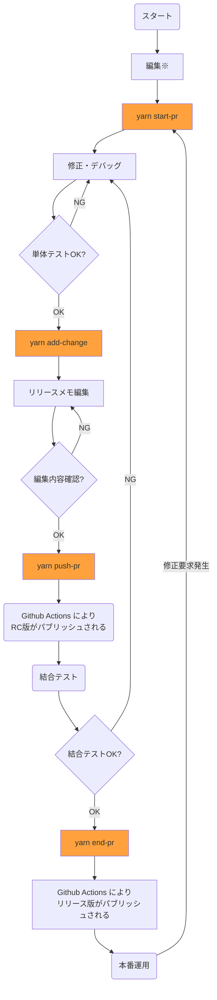

# cs-tools
[Changesets](https://github.com/changesets/changesets) を使って
Github flow を運用するための CLI のツールである。
Changesets と Github flow の組み合わせにおいては、その運用手順が複雑になるが、
このツールの導入により、手順を簡略化することができる。
また、 Changesets 導入のメリットとしてリリースメモを添付できることが挙げられる。
リリースメモに変更点を記載するため、コミットメッセージやプルリクエストのタイトルでは詳しい情報を表現する必要がなくなり、定型的なものを自動生成とすることができる。

## 前提条件
本ツールを利用については以下が前提となる

- github flow の手順で github.com を使用しているリポジトリが対象である
- Github Packages の npm レジストリかコンテナレジストリに push するために利用する
- 開発環境で [Github CLI](https://cli.github.com/)、 [node.js 16.x 以上](https://nodejs.org/en)および [yarn](https://yarnpkg.com/) が利用可能である
- デフォルトブランチのブランチ名が main である(デフォルトブランチのブランチ名が master になっている場合には対応していないので注意が必要)

fork したリポジトリから fork 元リポジトリにプルリクエストを出す場合も利用できる。
その場合、 git の remote 名とそのURLが以下のように設定されている必要がある。

|remote 名|リポジトリURL|
|--|--|
|origin|forkしたリポジトリ|
|upstream|fork元リポイジトリ|

## 手順概要

以下に main ブランチから始める場合の利用手順を示す。オレンジ色の箱は cs-tools のコマンドを実行することを示している。


※ package.json の編集が Changesets の編集と競合したり、main ブランチを pull した際に競合が発生する場合があるので、推奨できない。ただし、ファイルを編集してしまうと yarn start-pr ができないというわけではない。

## 前提となる環境

### 必要なソフトウェアがインストールされていること

node.js, yarn, Github CLI, git がインストールされている必要がある。
以下のコマンドでバージョンが確認できればよい。バージョンは以下に表示されているものより上位であれば問題ない。
```
$ node --version
v18.18.2
$ yarn --version
1.22.21
$ gh --version
gh version 2.40.1 (2023-12-13)
https://github.com/cli/cli/releases/tag/v2.40.1
$ git --version
git version 2.39.3
```

#### node と yarn のインストール

コンテナレジストリに対して使用する場合 node と yarn がインストールされていない場合があると思われるが、まず、以下のURLなどを参照してインストールしていただく必要がある。

https://nodejs.org/en/download/package-manager

その後、以下のコマンドを実行して yarn をインストールしていただく必要がある。
```
npm install --global yarn
```

#### Github CLI のインストール

Github CLI はインストールされていない場合が多いと思われるが、下のURLなどを参照してインストールしていただく必要がある。

https://github.com/cli/cli?tab=readme-ov-file#installation


### git のリポジトリであること

git init, git clone などで github のリモートリポジトリをトラッキングした状態のリポジトリで始める必要がある。
git status コマンドの結果が以下のような表示であれば、問題ない。
```
$ git status
On branch main
Your branch is up to date with 'origin/main'.
```

### パッケージマネージャ yarn で管理されていること

リポジトリのルートディレクトリに package.json が配置されている必要がある。

#### npm レジストリ
npm レジストリへのパブリッシュはGithub Actions から```yarn publish```を実行することで行うため、package.json の name プロパティの値は```@procube/cs-tools```のようにスコープを含めてレジストリに登録される名前になっていなければならない。

#### コンテナレジストリ
コンテナレジストリに push する場合は、 [changesets のマニュアル](https://github.com/changesets/changesets/blob/main/docs/versioning-apps.md)に従って、以下のような package.json を作成すれば良い。

```
{
  "name": "my-project",
  "private": true,
  "version": "0.0.1"
}
```

このとき、 name 属性がコンテナレジストリのパッケージ名となる。現在のバージョンでは、レジストリは ghcr.io 固定である。

## 導入手順
以下の手順で導入する。
1. ```yarn add --dev @procube/cs-tools``` で cs-tools をインストール
2. npm レジストリにリリースする場合は ```yarn init-cs-tools npm```、コンテナレジストリにリリースする場合は ```yarn init-cs-tools container-image``` で cs-tools と Changesets の設定を初期化
3. Github パーソナルアクセストークンを取得して環境変数 GH_TOKEN に設定（リポジトリルートの .env に GH_TOKEN=XXX という形式で設定することも可）

Github パーソナルアクセストークンの取得方法は[ここ](https://docs.github.com/ja/authentication/keeping-your-account-and-data-secure/managing-your-personal-access-tokens#creating-a-personal-access-token-classic)を参照されたい。


## cs-tools コマンド

cs-tools のコマンドの機能は以下の通り。

### yarn init-cs-tools

手順 2. で.github/workflows にワークフロー定義ファイルが追加される。npm用とコンテナイメージ用で異なるものが追加される。


### yarn start-pr
```yarn start-pr``` を実行すると、プルリクエスト作成の準備を行う。具体的には以下のを実行する。
1. 最新の状態からプルリクエストを作成するために mainブランチをpull
1. 現在時刻に基づいて pr-%y%m%d%H%M%S フォーマットの名前のプルリクエスト用ブランチを作成
1. Chnagesets Prerelease モードに入る

ローカルリポジトリにプルリクエスト用ブランチがチェックアウトされた状態になる。

### yarn add-change
```yarn add-change``` を実行すると、修正レベルを設定してリリースメモを追加する。

実行時の
```
🦋  What kind of change is this for XXXX ? (current version is X.X.X)
```
の質問に対しては以下の通り選択する。

|修正レベル|選択肢|
|--|--|
|バグ修正など基本的な機能に変更がない軽微な修正|patch|
|下位互換を保ちながら機能追加を行う|minor|
|下位互換を保証しない大きな修正|major|

その後、
```
🦋 Please enter a summary for this change (this will be in the changelogs).
🦋    (submit empty line to open external editor)
🦋  Summary ‣
```
の質問に対して修正内容を入力する。日本語入力でカーソル位置がズレる場合や長文を入力する場合は、ここでは簡単な入力として、
コマンド終了後にリポジトリルートの .changeset ディレクトリに作成された .md ファイルのリリースメモをエディタで編集することが推奨される。
git の commit メッセージと異なり、 markdown を使用して長文のリリースメモを記載できいることが changesets の特長となっている。

また、
```
🦋  Is this your desired changeset? (Y/n) ‣ true
```
の質問に対してはリターンキーをそのまま押下すればよい。
入力を終了すると、
```
🦋  Changeset added! - you can now commit it
🦋  
🦋  If you want to modify or expand on the changeset summary, you can find it here
🦋  info プロジェクトルートディレクトリ.changeset/XXXX-XXXX-XXXX.md
```
と表示されるので、次の ```yarn push-pr``` を実行できる状態となる。
 ```yarn push-pr``` を実行される前にメッセージに表示されている .md ファイルのリリースメモをエディタで確認し、適宜修正することが推奨される。

### yarn push-pr
```yarn push-pr``` を実行するとプルリクエストの追加、あるいはプルリクエストへのプッシュを行う。具体的には以下を実行する。
1. Changesets でリリース候補版(rc: release candidate)のバージョンを付与
1. git に .changeset も含めて全てのファイルの変更を commit
1. git にバージョン名でタグ付け
1. github.com にプッシュ
1. push-pr が初回実行である場合は、プルリクエストを作成

上記 2. で git add -A を実行するため、 Untracked なファイルも全てコミットの対象となる。
不要なファイルがコミットされないように注意する必要がある。

このコマンドを実行すると、 Github Actions 上でワークフローが起動され、リリース候補版がパブリッシュされる。

### yarn end-pr
```yarn end-pr``` を実行すると、プルリクエストをマージしてリリース版をパブリッシュする。具体的には以下のことを実行する。
1. Changesets Prerelease モードを終了
1. Changesets でリリース版のバージョンを付与
1. git に .changeset も含めて全てのファイルの変更を commit
1. github.com にプッシュ
1. プルリクエストをマージ（コミットはSquash, ローカルリポジトリではmainブランチをチェックアウトして pull、ローカル、リモート共にプルリクエスト用ブランチは削除、）
1. forkしたリポジトリである場合はフォーク先リポジトリに変更内容を push 

このコマンドを実行すると Github Actions 上でワークフローが起動され、main ブランチにタグ付けが行われた後、リリース版がパブリッシュされる。

## コンテナビルド時の秘密情報の参照

コンテナイメージを push するリポジトリにおいて、ビルド時に秘密情報を参照する必要がある場合は、 ```.github/workflows/*.yml```の最後の行に build-args を追加しなければならない。
ファイルにコメントアウトで記載されている build-args をアンコメントし、 Github の secrets の変数を参照することが推奨される。
