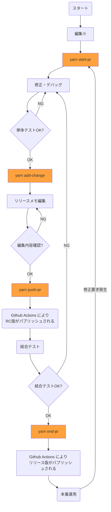

# cs-tools
[Changesets](https://github.com/changesets/changesets) を使って
Github flow を運用するための CLI のツールである。
Changesets と Github flow の組み合わせにおいては、その運用手順が複雑になるが、
このツールの導入により、手順を簡略化することができる。
また、 Changesets 導入のメリットとしてリリースメモを添付できることが挙げられる。
リリースメモに変更点を記載するため、コミットメッセージやプルリクエストのタイトルでは詳しい情報を表現する必要がなくなり、定型的なものを自動生成とすることができる。

## 前提条件
本ツールを利用については以下が前提となる

- github flow の手順で github.com を使用しているリポジトリが対象である
- Github Packages の npm レジストリかコンテナレジストリに push するために利用する
- 開発環境で node.js 16.x 以上および yarn が利用可能である
- デフォルトブランチのブランチ名が main である(デフォルトブランチのブランチ名が master になっている場合には対応していないので注意が必要)

開発環境が fork したリポジトリで fork 元リポジトリにプルリクエストを出す場合も利用できる。
その場合、 git の remote 名とそのURLが以下のように設定されている必要がある。

|remote 名|リポジトリURL|
|--|--|
|origin|forkしたリポジトリ|
|upstream|fork元リポイジトリ|

## 手順概要

以下に main ブランチから始める場合の利用手順を示す。


※ package.json の編集が Changesets の編集と競合したり、main ブランチを pull した際に競合が発生する場合があるので、推奨できない。ただし、ファイルを編集してしまうと yarn start-pr ができないというわけではない。

## 導入手順

以下の手順で導入する。

前提A. git init, git clone などで github のリモートリポジトリをトラッキングした状態のリポジトリで始める

前提B. package.json が設定されている（未作成の場合は yarn init で作成する）
1. ```yarn add --dev @procube/cs-tools``` で cs-tools をインストール
2. npm レジストリにリリースする場合は ```yarn init-cs-tools npm```、コンテナレジストリにリリースする場合は ```yarn init-cs-tools container-image``` で cs-tools と Changesets の設定を初期化
3. Github パーソナルトークンを取得して環境変数 GH_TOKEN に設定（リポジトリルートの .env に GH_TOKEN=XXX という形式で設定することも可）


## cs-tools コマンド

cs-tools のコマンドの機能は以下の通り。

### yarn start-pr
以下のことを実行する。
1. 最新の状態からプルリクエストを作成するために mainブランチをpull
1. プルリクエスト用ブランチを作成
1. Chnagesets Prerelease モードに入る

### yarn add-change

1. Changeset を追加する

### yarn push-pr

1. Changesets でリリース候補版(rc: release candidate)のバージョンを付与
1. git に .changeset も含めて全てのファイルの変更を commit
1. git にバージョン名でタグ付け
1. github.com にプッシュ
1. push-pr が初回実行である場合は、プルリクエストを作成

### yarn end-pr

1. Changesets Prerelease モードを終了
1. Changesets でリリース版のバージョンを付与
1. git に .changeset も含めて全てのファイルの変更を commit
1. git にバージョン名でタグ付け
1. github.com にプッシュ
1. プルリクエストをマージ（コミットはSquash, ローカルリポジトリではmainブランチをチェックアウトして pull、ローカル、リモート共にプルリクエスト用ブランチは削除、）
1. forkしたリポジトリである場合はフォーク先リポジトリに変更内容を push 